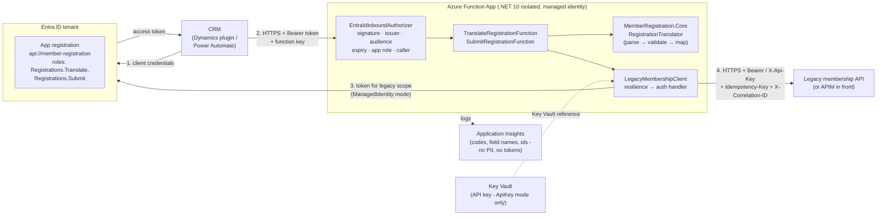
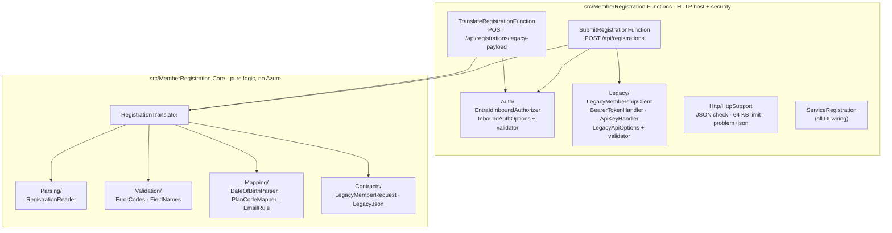
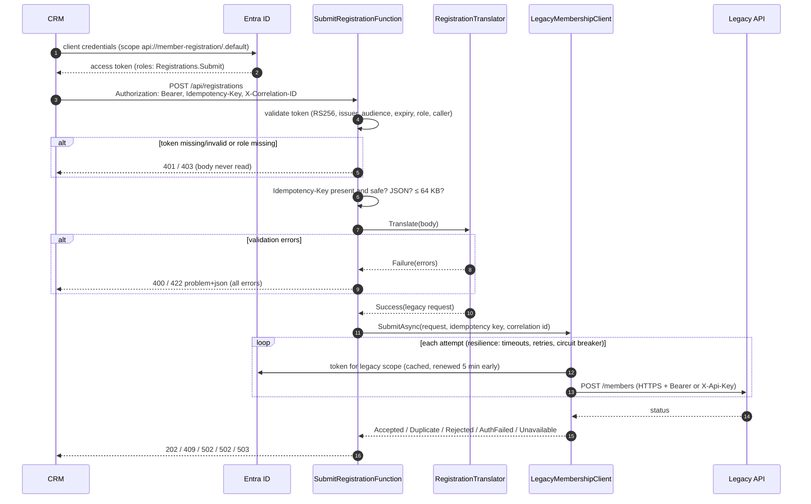

# Member Registration → Legacy Payload

An HTTP-triggered Azure Function (.NET 10, isolated worker). It takes a member registration in the CRM's JSON shape, validates it, and returns the request body the legacy membership system's API expects.

```
POST /api/registrations/legacy-payload
{ "firstName": "Alex", "lastName": "Nguyen", "dateOfBirth": "1990-04-12",
  "email": "alex.nguyen@example.com", "membershipType": "Single", "registeredAt": "2026-06-01T09:00:00Z" }

200 OK
{ "member": { "given_name": "Alex", "family_name": "Nguyen", "dob": "12/04/1990",
  "contact": { "email": "alex.nguyen@example.com" }, "plan_code": "S", "source": "MILKYWAY" } }
```

The full design, covering every validation rule, error code and the reasoning behind it, is in [`docs/DESIGN.md`](docs/DESIGN.md). A Word version of the architecture, with a step-by-step guide to running and testing it on another machine, is in [`docs/Architecture-and-Local-Setup.docx`](docs/Architecture-and-Local-Setup.docx).

## Architecture

### Deployed view



### Code layers



### Submit request flow



## Run it

```bash
dotnet test                       # 234 tests, no external services needed
```

To run the function locally you need [Azure Functions Core Tools v4](https://learn.microsoft.com/azure/azure-functions/functions-run-local) and Azurite, or point `AzureWebJobsStorage` at a storage account:

```bash
cd src/MemberRegistration.Functions
func start
curl -X POST http://localhost:7071/api/registrations/legacy-payload \
  -H "Content-Type: application/json" \
  -d '{"firstName":"Alex","lastName":"Nguyen","dateOfBirth":"1990-04-12","email":"alex.nguyen@example.com","membershipType":"Single"}'
```

## Layout

| Project | Role |
|---|---|
| `src/MemberRegistration.Core` | All the parsing, validation and mapping. It has no Azure dependency, so it can be reused behind any trigger |
| `src/MemberRegistration.Functions` | A thin HTTP adapter: content type, body size limit, status codes, logging |
| `tests/MemberRegistration.Tests` | xUnit tests for the mapping, every validation failure, plan codes, date conversion and the HTTP adapter |

## Behaviour at a glance

| Situation | Result |
|---|---|
| Valid registration | **200** with the legacy JSON |
| Required field missing, `null`, empty or whitespace | **422** `required` |
| Field is not a string (e.g. `"firstName": 123`) | **422** `invalid_type` |
| Implausible email | **422** `invalid_email` |
| `membershipType` not Single/Couple/Family (case-insensitive) | **422** `invalid_membership_type` |
| `dateOfBirth` not `yyyy-MM-dd` (an ISO date-time is also accepted) | **422** `invalid_date_format` |
| `dateOfBirth` impossible (`1990-02-30`), in the future, or before 1900 | **422** `invalid_date` |
| Unknown extra fields | Ignored |
| Body empty, not JSON, not an object, or with a duplicate key | **400** |
| Content-Type not JSON / body over 64 KB | **415** / **413** |

All validation errors are returned together as `application/problem+json`, each with `field`, `code` and `message`. Messages never repeat the submitted value, and logs record only field names and codes, because the values are personal information.

**Decisions worth flagging:**
- **Slash dates are rejected rather than guessed.** `12/04/1990` could be 12 April or 4 December, and a wrong date of birth saved silently to a member record is worse than a clear error.
- **`source` is `MILKYWAY`.** The brief's prose writes it as `" MILKYWAY "` with spaces, but the contract example has none, so the example wins. It is one constant (`RegistrationTranslator.Source`) if that turns out to be wrong.
- **The future-date check uses the furthest-ahead time zone (UTC+14),** so a baby registered on its birth day in Australia isn't rejected because UTC is still on the previous day.

## Wiring this into a real outbound call

This function only builds the payload. In production the legacy API call would work like this:

**Delivery.** Put a queue in front of the call instead of calling the legacy API synchronously from the CRM. The CRM, through a Dynamics plugin or Power Automate flow, sends registrations to an **Azure Service Bus** queue. A Service Bus-triggered function runs `RegistrationTranslator` (unchanged) and posts the result. This gives at-least-once delivery, buffering while the legacy system is down, and a **dead-letter queue**: validation failures go there immediately, transient failures go there only after retries run out.

**HTTP client.** A typed `HttpClient` from `IHttpClientFactory`, with `Microsoft.Extensions.Http.Resilience`:

```csharp
services.AddHttpClient<LegacyMembershipClient>(c => c.BaseAddress = new Uri(config["Legacy:BaseUrl"]!))
    .AddStandardResilienceHandler(o =>
    {
        o.AttemptTimeout.Timeout = TimeSpan.FromSeconds(10);
        o.TotalRequestTimeout.Timeout = TimeSpan.FromSeconds(30);
        o.Retry.MaxRetryAttempts = 3;            // exponential backoff + jitter
        o.Retry.UseJitter = true;
    });
```

- **Timeouts:** about 10 s per attempt and about 30 s in total, so one slow call can't hold a worker indefinitely. Legacy systems are often slow, so tune these against observed p99 latency.
- **Retries:** only on transient failures: network errors, 408, 429 (respecting `Retry-After`), 500, 502, 503 and 504. **Never** retry on 400 or 422, because the same payload will fail again. That message goes straight to the dead-letter queue.
- **Circuit breaker** (part of the standard handler): stops calling a legacy system that is clearly down, and lets the queue absorb the backlog.

**Idempotency.** Retries and at-least-once delivery mean the same registration *will* sometimes be sent twice. Send an `Idempotency-Key` header derived from the CRM record id. If the legacy API doesn't support that, check for an existing member by that key before creating one. Without this, retries create duplicate members.

**Authentication.** Implemented on both ends - see [Security](#security) below.

**Observability.** Pass a correlation id (the CRM record id) to the legacy call as a header, and log it on both sides. Alert on dead-letter queue depth, circuit-breaker opens and the rate of 4xx responses from the legacy API. A rising 4xx rate usually means the contract has drifted.

## Security

Both ends are authenticated, and the Function refuses to start if either is misconfigured.

### Inbound: CRM → Function (Entra ID bearer tokens)

Every request must carry an **Entra ID access token** for this API, validated in code by `EntraIdInboundAuthorizer` before the body is read:

| Check | Rule |
|---|---|
| Signature | RS256 only, against the tenant's published signing keys (fetched from OpenID metadata, refreshed on key rotation). Unsigned (`alg: none`) and HMAC tokens are refused |
| Issuer | The configured tenant only (v2.0 and v1.0 issuer forms) |
| Audience | This API (`api://…` or its bare client id) - a token for any other API is refused |
| Lifetime | Must not be expired; 2-minute clock skew |
| App role | `Registrations.Translate` for `/registrations/legacy-payload`, `Registrations.Submit` for `/registrations` |
| Caller | Optional allow-list of caller app ids (`azp`/`appid`) - pin it to the CRM's identity |

401 (with `WWW-Authenticate: Bearer`) for a missing or invalid token, 403 for a valid token without the role or from a caller off the list. Responses never say which check failed; the reason and the caller's app id are logged, the token never is. The **function key stays** as a second layer.

**Entra ID setup:** register an app for this API, set its Application ID URI (e.g. `api://member-registration`), and define the two app roles (allowed member type: *Applications*). Grant the CRM's identity (its managed identity, or the app registration the Dynamics plugin / Power Automate flow uses) the roles it needs as application permissions, with admin consent. The CRM then requests a token for `api://member-registration/.default`.

### Outbound: Function → legacy API

`POST /api/registrations` translates and submits through `LegacyMembershipClient`. Every attempt (including retries) is authenticated by a handler inside the resilience pipeline:

| `LegacyApi:Auth:Mode` | Credential |
|---|---|
| `ManagedIdentity` (default) | Entra ID token for `LegacyApi:Auth:Scope` from the Function's managed identity (`DefaultAzureCredential`; set `ManagedIdentityClientId` for a user-assigned one). Cached and renewed 5 minutes before expiry. No secrets anywhere |
| `ApiKey` | Static key sent in `LegacyApi:Auth:ApiKeyHeader` (default `X-Api-Key`). The value must be a **Key Vault reference** in app settings: `@Microsoft.KeyVault(SecretUri=https://<vault>.vault.azure.net/secrets/legacy-api-key/)`, with the Function's identity granted *Key Vault Secrets User* |
| `None` | Development only - for a local stub |

The base URL must be **https**; plain http is only accepted for `localhost` in Development. The caller's own token is never forwarded. Each submission carries the caller's **`Idempotency-Key`** (required, e.g. the CRM record id) and an **`X-Correlation-ID`**; both are restricted to `[A-Za-z0-9._:-]{1,128}` so they can't inject headers or log lines. Legacy responses map to: 2xx → **202**, 409 → **409** (already exists), other 4xx → **502**, 401/403 from the legacy API → **502** (our credential problem, logged as an error, never shown to the caller), timeouts / 5xx after retries / open circuit → **503** (retry with the same `Idempotency-Key`).

### Configuration

| Setting | Example |
|---|---|
| `Auth__Inbound__TenantId` | `11111111-2222-3333-4444-555555555555` |
| `Auth__Inbound__Audience` | `api://member-registration` |
| `Auth__Inbound__AllowedCallerAppIds__0` | the CRM identity's client id (optional) |
| `LegacyApi__BaseUrl` | `https://legacy.example.com/api` |
| `LegacyApi__SubmitPath` | `members` |
| `LegacyApi__Auth__Mode` | `ManagedIdentity` or `ApiKey` |
| `LegacyApi__Auth__Scope` | `api://legacy-membership/.default` |
| `LegacyApi__Auth__ApiKey` | `@Microsoft.KeyVault(SecretUri=…)` (ApiKey mode only) |

Startup fails, naming the setting, if the tenant or audience is missing, the legacy URL isn't https, the scope or key for the chosen mode is missing, or `Disabled`/`None` is used outside Development. `local.settings.json` runs in Development with inbound auth disabled and a local http stub, and holds no secrets.
